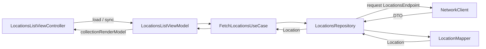

# BUUT Assignment — Locations

Small UIKit app that loads a list of locations from the assignment JSON endpoint and shows them in a scrollable list, with pull-to-refresh, empty/loading/error states, and a detail screen.

## Requirements

- Xcode 16+ (Swift 6)
- iOS **17.6**+

Open `BUUT-Assignment.xcodeproj`, select a simulator or device, run the **BUUT-Assignment** scheme.

## Networking — LightweightNetworking

**[LightweightNetworking](https://github.com/aaguseynov/LightweightNetworking)** is **my own public library** (Swift Package Manager). It provides `Endpoint`-driven HTTP, `URLSession`, and JSON decoding in a small API surface. This assignment uses it intentionally to show real-world integration of something I maintain.

In the app, **`NetworkClient`** is registered in DI (`AppAssembly`), and **`LocationsEndpoint`** targets the assignment JSON URL.

## UI — list built with `UICollectionView`

The locations screen is **not** `UITableView`: it uses **`UICollectionView`** with **`UICollectionViewCompositionalLayout`** (single-column vertical list), **`UICollectionViewDiffableDataSource`**, and cell registration. Shared UI is wrapped in **`DiffableCollectionComponent`**, which also applies loading / empty / error backgrounds and a refresh control.

## Architecture

The app follows **layered feature architecture** with a **composition root** (coordinators + DI), **protocol-oriented** boundaries between layers, and **UIKit** only in presentation. The goal is clear ownership: transport and JSON live in Data, rules in Domain, screens in Presentation, navigation in Coordinators.

### Bootstrapping

1. **`SceneDelegate`** creates `UIWindow` and **`ApplicationCoordinator`**, which is a **`RootCoordinator`**: it owns a root **`DIContainer`**, immediately applies **`AppAssembly`**, and starts the UI flow.
2. **`ApplicationCoordinator`** embeds the app in a `UINavigationController`, builds **`LocationsFlowCoordinator`** with the **same** parent container, and calls `coordinate(to:)`.
3. **`DIAssemblyResultCoordinator`** (base for app + feature flows): when you start a child coordinator that also uses DI, it creates a **child container** (`makeChild()`), applies that child’s **`assemblies()`** on top of the parent, and assigns it to the child. Registrations in the child **override** the parent for the same type; unresolved types **fall back** to the parent (similar in spirit to nested Swinject assemblers).

### Dependency injection (`DIContainer` + `Assembly`)

- **`Assembly`**: a type that mutates a container in `assemble(into:)`.
- **`AppAssembly`**: global services only — e.g. **`NetworkClient`** with a tuned `URLSessionConfiguration` (no response cache for this assignment).
- **`LocationsAssembly`**: everything for the Locations feature — protocols **`LocationsRepositoryProtocol`**, **`FetchLocationsUseCaseProtocol`**, **`LocationMapping`**, list strings, item mapping, wired to concrete types.
- **Scopes**:
  - **`.container`** — one shared instance per container (used for `NetworkClient`).
  - **`.weak`** — reuse while something else strongly retains the instance; weak cache keyed by resolved type (see `WeakInstanceBox` in code).
  - **`.transient`** — new instance on every `resolve` (default if not specified).

View models are created in **`LocationsFlowCoordinator`** with `container.resolve(...)` and passed into **`LocationsModule`**, so view controllers stay initializer-clean and test-friendly.

### Coordinators vs view controllers

- **Coordinators** decide **where** to go next (push/pop, which module to show) and **wire callbacks** (e.g. `onLocationDetailRequested` → push detail).
- **View controllers** focus on **layout, targets/actions, and syncing** from the view model; they do not own `UINavigationController` push logic beyond what the coordinator injected as closures.

`LocationsFlowCoordinator` applies **`LocationsAssembly`** on its child container, resolves dependencies, constructs **`LocationsListViewModel`**, wraps **`LocationsListViewController`** in **`LocationsModule`**, and sets the navigation stack’s root.

### Feature module pattern (`FeatureModule` / `BaseModule`)

A **module** is a thin wrapper: **input** (commands from outside), **output** (events/callbacks), and a **root `UIViewController`**. **`LocationsModule`** exists so the list screen can be built with a pre-made view model (e.g. tests or previews) while keeping one place that owns the VC + module boundary.

### Locations feature layers (folder layout)

| Layer | Responsibility | Main types |
|-------|----------------|------------|
| **Domain** | Business meaning of a location; loading locations without knowing HTTP or UIKit. | `Location`, `FetchLocationsUseCase` (+ protocol), `LocationsRepositoryProtocol` |
| **Data** | Remote I/O, DTOs, mapping to domain. | `LocationsEndpoint`, `LocationsResponseDTO`, `LocationMapper`, `LocationsRepository`, `FetchErrorFormatting` (user-facing error strings from `NetworkError`) |
| **Presentation** | State, user actions, view-friendly models. | `LocationsListViewModel`, `LocationsListState`, `LocationsListViewController`, `LocationListItemViewData`, `LocationsListItemMapping`, detail VM/VC |
| **Coordinator** | Locations-only navigation. | `LocationsFlowCoordinator` |

**Dependency rule (intended):** Presentation depends on Domain protocols; Data implements those protocols and depends on networking + DTOs. Domain does not import UIKit or LightweightNetworking.

### List UI composition

- **`DiffableCollectionRenderModel`** describes one render pass: **items**, **overlay** (none / loading / message / error), **interaction** and **refresh** flags.
- **`DiffableCollectionComponent`** owns **`UICollectionViewDiffableDataSource`**, applies snapshots, toggles **`backgroundView`** for overlays, and drives **`UIRefreshControl`**.
- **`DiffableCollectionOverlayBuilding`** (default builder + overlay views) keeps overlay visuals swappable without changing the collection component.

### End-to-end data flow (load list)

After mapping, list rows use **`LocationsListItemMapper`** (`Location` → **`LocationListItemViewData`**) inside the view model’s **`collectionRenderModel`** so cells stay dumb and the coordinator can still receive **`Location`** for the detail screen (`onLocationDetailRequested`).

### Cross-cutting folders

- **`Application/`** — app entry, root coordinator, `AppAssembly`.
- **`Coordinator/`** — generic coordinator base types, navigation helpers, DI-backed coordinator.
- **`DIContainer/`** — container + `Assembly` protocol.
- **`Components/`** — reusable UIKit building blocks not tied to a single feature.
- **`FeatureModule/`** — shared module protocol and `BaseModule`.

Together, this keeps **networking and JSON** behind **`LocationsRepository`** and **`NetworkClient`**, **navigation** in coordinators, and **screen state** in view models, which matches the assignment’s UIKit-first list app while staying structured for review and extension.

## Assignment endpoint

Data source: `https://raw.githubusercontent.com/abnamrocoesd/assignment-ios/main/locations.json` (see `LocationsEndpoint`).
